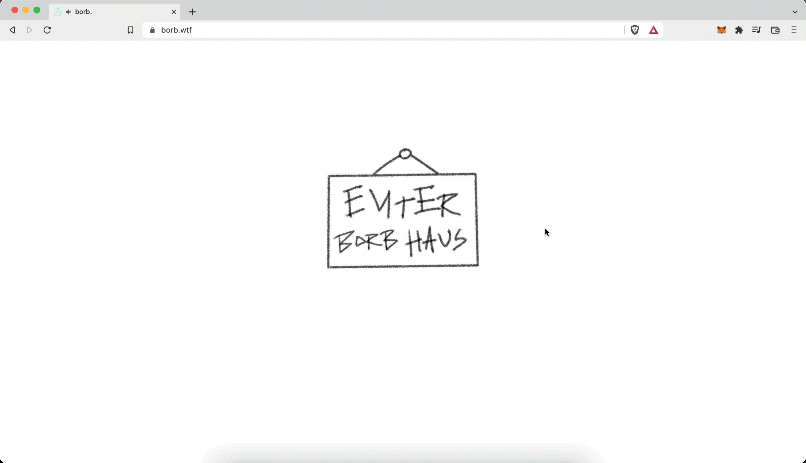

# NFT Minting Website
This is the website I built as part of an NFT collection I launched over the summer. This site allows you to connect your Ethereum wallet to Metamask and to then mint your own unique NFT. It utilizes Merkle/Hash trees to verify if the wallet connected is on the "whitelist" and is pre-approved to mint. Additionaly, I wrote, tested and deployed the Solidity smart contract.

- Website: https://borb.wtf
- Opensea: https://opensea.io/collection/borbsnft

